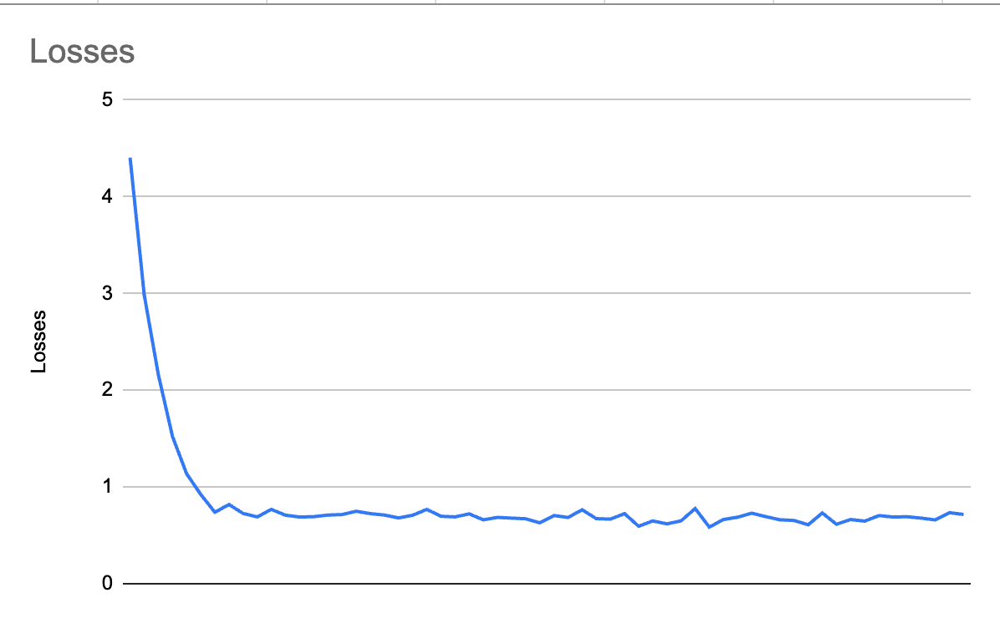

<div align="center">


> Qwen based Darkweb Researching Model

  [](https://pytorch.org/) [](https://github.com/y3chnx/qwen_tor_researcher) [](https://huggingface.co/y3chnx/qwen-tor-researcher)
</div>

## 📋 Table of Contents

- [Installation](#installation)
- [Training](#Training)

## ℹ️ Project Information

- **👤 Author:** y3chnx
- **📄 License:** MIT

## Installation

***Talk with Qwen Tor Researcher using Ollama***
```
ollama run hf.co/y3chnx/qwen-tor-researcher-gguf:F16
```
<br>

***Talk with Qwen Tor Researcher using llama.cpp***
```
llama-server -hf y3chnx/qwen-tor-researcher-gguf:F16
```
<br>

```
llama-cli -hf y3chnx/qwen-tor-researcher-gguf:F16
```

## Training
<br>
These are the training losses for this model. <br>

